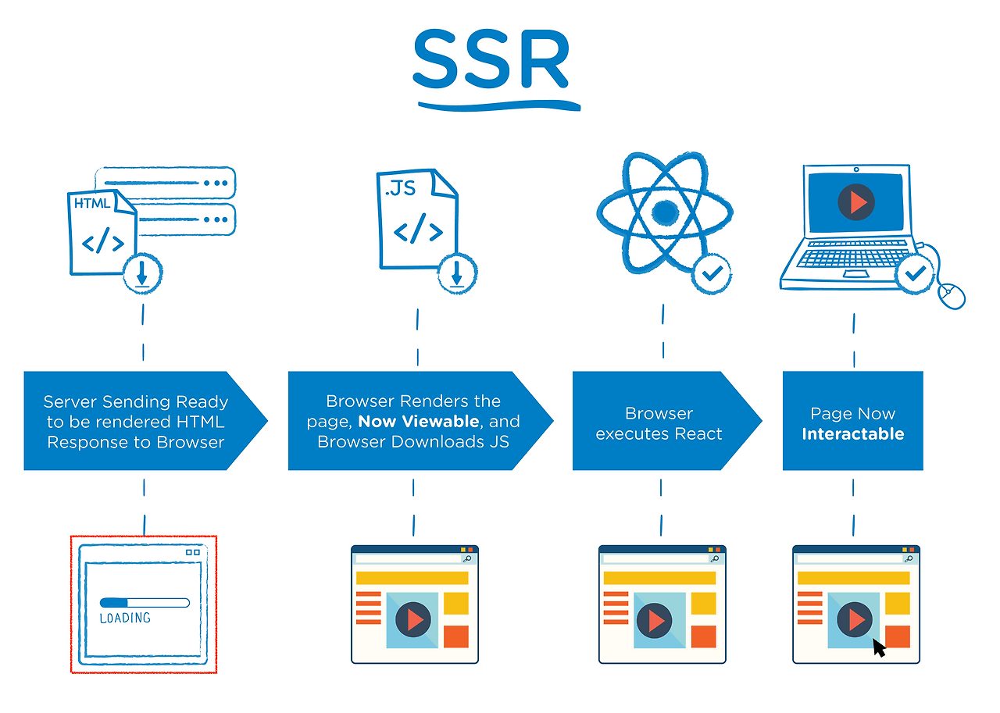

# 카우 웹 세션

📚 학습 주제 - 브라우저 동작 방법, DOM과 Virtual, DOM, MPA vs SPA, CSR vs SSR

# 웹 브라우저

웹 브라우저란 웹에서 정보를 탐색하고 HTML 문서, 이미지 등 여러 콘텐츠를 우리에게 표현해주는 소프트웨어로 구글의 크롬(Chrome), 애플의 사파리(Safari), 마이크로소프트 엣지(Microsoft Edge), 모질라의 파이어폭스(Firefox) 등이 있다.

브라우저의 주요 기능은 사용자가 선택한 자원을 서버에 요청하고 브라우저에 표시하는 것이다. 자원은 보통 HTML 문서지만 다른 형태일 수 있다. 자원의 주소는 URI(Uniform Resource Identifier)에 의해 정해진다.
브라우저는 HTML과 CSS 명세에 따라 HTML 파일을 해석해서 표시하는데 이 명세는 웹 표준화 기구인 W3C(World Wide Web Consortium)에세 정한다.

## 브라우저 동작

브라우저가 웹 페이지를 화면에 그리기까지의 과정은 'Critical Rendering Path(핵심 렌더링 경로)'라고 불린다.

  

1.  **HTML 파싱 (Parsing)**: 브라우저는 서버로부터 받은 HTML 문서를 읽고, `DOM(Document Object Model)`이라는 트리 구조의 객체 모델을 만든다.
2.  **CSS 파싱 (Parsing)**: HTML을 파싱하다가 CSS 링크나 스타일 태그를 만나면, CSS 코드를 읽고 `CSSOM(CSS Object Model)`이라는 스타일 규칙 트리 모델을 만든다.
3.  **렌더 트리 생성 (Render Tree)**: DOM 트리와 CSSOM 트리를 결합하여 `렌더 트리(Render Tree)`를 생성한다. 렌더 트리는 화면에 실제로 **표시될 요소**들만 포함한다. (`display: none;` 같은 속성이 적용된 노드는 렌더 트리에 포함되지 않는다.)
4.  **레이아웃 (Layout / Reflow)**: 렌더 트리의 각 노드들이 화면의 어느 위치에, 어떤 크기로 배치되어야 하는지를 계산하는 단계다.
5.  **페인트 (Paint)**: 레이아웃 계산이 완료된 각 노드를 화면에 실제 픽셀로 그리는 단계다.
6.  **합성 (Composite)**: 여러 레이어를 순서대로 합성하여 최종적인 화면을 완성한다. 이 과정을 통해 스크롤이나 애니메이션이 부드럽게 처리된다.

## 2. DOM vs Virtual DOM

### 2.1. DOM (Document Object Model)

DOM은 HTML 문서의 구조를 자바스크립트가 접근하고 조작할 수 있도록 만든 트리 형태의 인터페이스다. DOM의 노드를 직접 수정하면, 브라우저는 위에서 설명한 **레이아웃(Reflow)** 과 **페인트(Repaint)** 과정을 다시 거치게 된다. 이러한 과정은 비용이 크기 때문에 잦은 DOM 변경은 웹 페이지 성능 저하의 주된 원인이 된다.

  

### 2.2. Virtual DOM (가상 DOM)

Virtual DOM은 실제 DOM을 추상화한 가벼운 자바스크립트 객체다. React, Vue와 같은 현대적인 프레임워크에서 DOM을 직접 조작하는 대신, 메모리에 Virtual DOM을 두고 변경 사항을 관리하여 성능을 최적화한다.

**동작 방식:**

1.  데이터(상태)가 변경되면, 전체 UI를 Virtual DOM으로 다시 렌더링한다.
2.  이전 Virtual DOM과 새로 만들어진 Virtual DOM을 비교하여 변경된 부분만 찾아낸다. (이 과정을 **Diffing**이라고 한다.)
3.  변경이 감지된 부분만 **실제 DOM에 한 번에 적용(Batch Update)** 한다.

이 방식을 통해 불필요한 DOM 조작을 최소화하여 렌더링 성능을 크게 향상시킬 수 있다.

  

| 구분              | DOM (Document Object Model)                     | Virtual DOM (가상 DOM)                                            |
| :---------------- | :---------------------------------------------- | :---------------------------------------------------------------- |
| **정의**          | 브라우저가 HTML 문서를 이해하는 표준 인터페이스 | 실제 DOM을 추상화한 가벼운 JS 객체                                |
| **업데이트 방식** | 변경 시마다 직접 수정 (Reflow/Repaint 발생)     | 변경 사항을 모아 한 번에 실제 DOM에 적용 (Diffing & Batch Update) |
| **성능**          | 잦은 변경 시 성능 저하 가능성 높음              | 불필요한 렌더링을 줄여 성능 최적화                                |
| **속도**          | 상대적으로 느림                                 | 상대적으로 빠름                                                   |

## 3. MPA vs SPA

### 3.1. MPA (Multiple Page Application)

MPA는 여러 개의 독립적인 HTML 페이지로 구성된 전통적인 웹 애플리케이션 방식이다. 사용자가 링크를 클릭하여 다른 페이지로 이동할 때마다, 서버는 새로운 HTML 문서를 통째로 전달하고 브라우저는 페이지 전체를 새로고침한다.

- **장점**: SEO(검색 엔진 최적화)에 유리하고, 초기 개발이 비교적 단순하다.
- **단점**: 페이지 이동 시 깜빡임(Blinking)이 발생하며, 불필요한 부분까지 다시 로드하므로 사용자 경험이 저하될 수 있다.

### 3.2. SPA (Single Page Application)

SPA는 단 하나의 HTML 페이지에서 동작하는 애플리케이션이다. 최초 로딩 시 필요한 모든 리소스(HTML, CSS, JS)를 한 번에 불러온 후, 페이지 이동 시에는 서버로부터 데이터(JSON 형태)만 받아와 자바스크립트를 통해 동적으로 페이지의 특정 부분만 다시 그린다.

- **장점**: 페이지 이동이 부드럽고 빨라 앱과 같은 사용자 경험을 제공한다. 서버 트래픽이 감소한다.
- **단점**: 초기 로딩 시간이 길 수 있으며, SEO 처리가 MPA에 비해 복잡하다.

  

| 항목               | MPA (Multiple Page Application)                           | SPA (Single Page Application)                                 |
| :----------------- | :-------------------------------------------------------- | :------------------------------------------------------------ |
| **구조**           | 여러 개의 독립된 HTML 페이지                              | 단일 HTML 페이지와 동적 컴포넌트                              |
| **페이지 이동**    | 서버로부터 새 페이지를 받아 **전체 리로드** (깜빡임 발생) | 필요한 데이터만 받아와 **페이지 일부만 동적 교체** (부드러움) |
| **초기 로딩 속도** | 해당 페이지만 로드하여 빠를 수 있음                       | 모든 리소스를 받아와 느릴 수 있음                             |
| **사용자 경험**    | 페이지 이동 시 끊기는 느낌                                | 앱처럼 부드럽고 연속적인 느낌                                 |
| **SEO**            | 각 페이지가 명확하여 SEO에 **유리**                       | 초기 HTML이 비어있어 SEO에 **불리** (기술적 보완 필요)        |
| **서버 부하**      | 페이지 요청마다 렌더링하여 부하가 큼                      | 초기 로딩 후 데이터만 요청하여 부하가 적음                    |

## 4. CSR vs SSR

이 개념은 브라우저에 표시될 페이지를 **어디서 그리는지(렌더링하는지)** 에 대한 구분이다.

### 4.1. CSR (Client-Side Rendering, 클라이언트 사이드 렌더링)

CSR은 렌더링의 주체가 클라이언트(브라우저)인 방식이다. 주로 **SPA**가 이 방식을 사용한다.

1.  브라우저는 서버로부터 거의 비어있는 HTML 파일과 자바스크립트 링크를 받는다.
2.  브라우저가 연결된 자바스크립트 파일을 다운로드한다.
3.  자바스크립트가 실행되면서 API를 통해 데이터를 요청하고, 받은 데이터를 기반으로 동적으로 DOM을 생성하여 페이지를 그린다.

- **장점**: 초기 로딩 후에는 페이지 전환이 빠르다. 서버의 부담이 적다.
- **단점**:
  - **느린 초기 로딩 속도**: 사용자는 자바스크립트가 모두 다운로드되고 실행될 때까지 빈 화면을 봐야 한다 (Time To Interact, TTI가 길어짐).
  - **SEO 문제**: 검색 엔진 크롤러가 자바스크립트를 실행하지 못하면 빈 HTML만 보게 되어 콘텐츠 수집이 어려울 수 있다.

  

### 4.2. SSR (Server-Side Rendering, 서버 사이드 렌더링)

SSR은 렌더링의 주체가 서버인 방식이다. 주로 **MPA**가 이 방식을 사용하지만, 최근에는 SPA의 단점을 보완하기 위해 Next.js(React), Nuxt.js(Vue) 같은 프레임워크에서 SSR을 지원한다.

1.  브라우저가 페이지를 요청한다.
2.  서버는 페이지에 필요한 데이터를 모두 가져와 렌더링할 준비를 한다.
3.  서버에서 **완성된 HTML 문서**를 만들어 브라우저에 응답으로 보낸다.
4.  브라우저는 완성된 HTML을 바로 화면에 표시한다.
5.  이후 자바스크립트 파일을 다운로드하여 페이지에 동적인 기능을 추가한다(이 과정을 **Hydration**이라고 한다).

- **장점**:
  - **빠른 초기 로딩 속도**: 사용자는 완성된 페이지를 즉시 볼 수 있다 (First Contentful Paint, FCP가 빠름).
  - **SEO에 유리**: 검색 엔진 크롤러가 처음부터 콘텐츠가 채워진 HTML을 받아보므로 색인에 유리하다.
- **단점**: 페이지 이동 시마다 서버에 요청을 보내야 하므로 서버 부하가 커질 수 있다.

  

| 항목                         | CSR (Client-Side Rendering)                                | SSR (Server-Side Rendering)                        |
| :--------------------------- | :--------------------------------------------------------- | :------------------------------------------------- |
| **렌더링 주체**              | **클라이언트** (웹 브라우저)                               | **서버**                                           |
| **초기 로딩 속도 (FCP)**     | JS 다운로드 및 실행 전까지 빈 화면이 보임 (**느림**)       | 완성된 HTML을 바로 보여줌 (**빠름**)               |
| **상호작용 가능 시점 (TTI)** | JS 실행이 완료되어야 가능 (**느림**)                       | HTML 표시 후 JS 실행(Hydration)이 완료되어야 가능  |
| **SEO**                      | 검색 엔진이 JS를 실행 못하면 콘텐츠 파악 어려움 (**불리**) | 완성된 HTML을 제공하여 콘텐츠 파악 용이 (**유리**) |
| **서버 부하**                | 렌더링 부담이 클라이언트에 있어 서버 부하 **적음**         | 모든 요청을 서버가 렌더링하여 부하 **큼**          |
| **주요 사용 방식**           | SPA                                                        | MPA (최근엔 SPA에서도 SSR 도입)                    |
