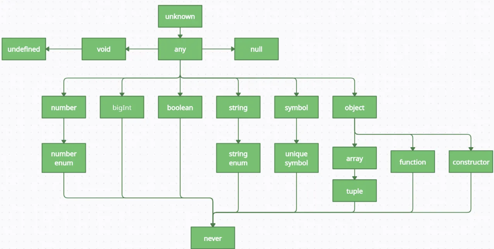

#


### JSX란?

JSX는 JavaScript의 문법 확장으로 JavaScript 파일 안에서 HTML과 유사한 마크업을 작성할 수 있게 해준다.

컴포넌트를 작성하는 다른 방법들도 있지만 대부분의 React 개발자들은 JSX의 간결함을 선호하며 대부분의 코드베이스는 JSX를 사용한다.

### JSX: Putting markup into JavaScript

**왜 JSX를 사용하는가 ?**

웹은 HTML, CSS, JavaScript 위에 구축되어있다.

오랫동안 웹 개발자들은 콘텐츠는 HTML, 디자인은 CSS, 로직은 JavaScript에 나누어 두었다.

하지만 웹이 점점 더 상호작용적이 되면서, 로직이 콘텐츠를 점점 더 많이 결정하게 되었다.

JavaScript가 HTML을 주도하게 된다 !

React에서 렌더링 로직과 마크업이 같은 곳, 즉 컴포넌트 안에 함께 존재하는 이유이다.

** 여기서 Markup은 `<div>`, `<h1>`, `<ul>` 같은 구조/콘텐츠를 표시하는 태그들을 의미


HTML


JavaScript

![Form.js - React Component] (https://react.dev/_next/image?url=%2Fimages%2Fdocs%2Fdiagrams%2Fwriting_jsx_form.dark.png&w=750&q=75)

Form.js - React Component

### React components with JSX

버튼의 렌더링 로직과 마크업을 함께 두면 좋은점

1. 수정할 때마다 서로 동기화된 상태를 유지할 수 있음
2. 반대로, 버튼의 마크업과 사이드바의 마크업처럼 관련 없는 세부사항은 서로 분리되어 있어 각자 안전하게 수정할 수 있음

> 각 React 컴포넌트 = **JavaScript 함수**
그 안에 **React**가 브라우저로 렌더링하는 **마크업을 포함**할 수 있다.
React 컴포넌트는 그 마크업을 표현하기 위해 **JSX라는 문법 확장을 사용**한다.
> 

**JSX와 HTML 차이점**

JSX는 HTML과 매우 비슷해 보이지만, 조금 더 엄격하며 **동적인 정보를 표시**할 수 있다.

이를 이해하는 가장 좋은 방법은 HTML 마크업을 JSX 마크업으로 변환해보는 것입니다.

만약 내가 이러한 html 파일이 있다고 하자

```python
<h1>Hedy Lamarr's Todos</h1>

<ul>
    <li>Invent new traffic lights
    <li>Rehearse a movie scene
    <li>Improve the spectrum technology
</ul>

```

이걸 JSX 로 변환해보자

```python
export default function TodoList() {
  return (
    // This doesn't quite work!
    <h1>Hedy Lamarr's Todos</h1>
    
    <ul>
      <li>Invent new traffic lights
      <li>Rehearse a movie scene
      <li>Improve the spectrum technology
    </ul>
  );
}
```

그러나 이렇게 1:1로 바꾸기만 하면 에러가 발생한다.

JSX가 HTML보다 더 엄격하고 몇 가지 규칙이 더 있기 때문 !

### JSX 규칙

1. **단일 루트 요소 반환**

React 컴포넌트는 반드시 **하나의 루트 태그**만 반환해야 한다.
왜냐면 Virtual DOM에서 컴포넌트 변화를 감지해 낼 때 효율적으로 비교할 수 있도록 !

**잘못된 예시:**

```jsx
function App() {
  return (
    <h1>Welcome</h1>
    <h2>Good to see you here.</h2>
  );
}

```

에러 발생: "Adjacent JSX elements must be wrapped…"

**올바른 예시 1 (div로 감싸기):**

```jsx
function App() {
  return (
    <div>
      <h1>Welcome</h1>
      <h2>Good to see you here.</h2>
    </div>
  );
}

```

**올바른 예시 2 (Fragment `<>...</>` 사용):**

```jsx
function App() {
  return (
    <><h1>Welcome</h1>
      <h2>Good to see you here.</h2>
    </>
  );
}

```

** Fragment (`<>...</>`)는 JSX 문법에서 여러 요소를 하나로 묶어줄 때 사용하는 **보이지 않는 부모 요소**

**2. 모든 태그는 닫아야 한다**

JSX에서는 태그를 반드시 닫아야 한다.

잘못된 예시:

```jsx

```

올바른 예시:

```jsx

```

```jsx
<div></div>
```

**3. 속성 이름 차이**

JSX는 JavaScript 예약어와 충돌을 피하기 위해 HTML 속성과 이름이 다를 수 있다.

HTML에서는 for, class 같은 속성을 쓸 수 있음

하지만 JavaScript에서는 for, class가 이미 예약어

for → 반복문에 사용 (for (let i=0; ...))

class → 클래스 선언 (class Person {})

JSX는 JavaScript 안에서 실행되므로, 이런 예약어를 그대로 쓰면 충돌이 발생한다.

**잘못된 예시:**

```jsx
<label for="username">Username</label>
<input class="input" />
```

**올바른 예시:**

```jsx
<label htmlFor="username">Username</label>
<input className="input" />
```

**4. 카멜 케이스 속성**

두 단어 이상인 속성은 JSX에서 **camelCase**를 사용한다.

**잘못된 예시:**

```jsx
<button tabindex="0" readonly>Click</button>
```

`tabindex`, `readonly` 같은 속성은 HTML에서는 소문자로만 써도 된다.
****

**올바른 예시:**

```jsx
<button tabIndex={0} readOnly>Click</button>
```

**5.  If문 대신 조건부 연산자**
    
JSX 내부의 자바스크립트 표현식에서 if문 사용 안됨 
    
→ JSX 외부에서 if문을 사용하여 사전에 값을 설정 or {  } 안에 조건부 연산자(삼항 연산자) 사용하면 됨  
    
```jsx
    function App() {
    	const name = '리액트';
    	return (
    		<div>
    			{name === '리액트' ? (
    				<h1> 리액트 입니다. </h1>
    				) : (
    				<h2> 리액트가 아닙니다. </h2> )}
    		</div>
    		);
    }
    
    export default App;
```
    
`const name = '리웩트';` 라고 하면 리액트가 아닙니다. 뜸

**6. 주석**
    
자바스크립트에서의 주석과 좀 다름 
    
JSX 내부에서 주석을 작성할 땐 `{/* … /*}` 와 같은 형식으로 작성함 - 여러줄 가능
    
시작태그를 여러줄로 작성할 때는 그 내부에서 `// …` 과 같은 형태로 작성 가능
    
```jsx
    import React from 'react';
    import './App.css';
    
    function App() {
      const name = '리액트';
      return (
        <>
          {/* 주석은 이렇게 작성합니다. */}
          <div
            className="react" // 시작 태그를 여러 줄로 작성하게 된다면 여기에 주석을 작성 할 수 있습니다.
          >
            {name}
          </div>
          // 하지만 이런 주석이나 
          /* 이런 주석은 페이지에 그대로 나타나게 됩니다. */
          <input />
        </>
      );
    }
    
    export default App;
```

출처: 

https://react.dev/learn/writing-markup-with-jsx

### props

properties를 줄인 표현으로 컴포넌트의 속성을 설정할 때 사용되는 요소

props는 해당 컴포넌트를 불러와 사용하는 부모 컴포넌트에서 설정할 수 있음

1. **JSX 내부에서 props 렌더링**
    
    MyComponent 컴포넌트를 수정하여 해당 컴포넌트에서 name이라는 props를 렌더링 하도록 수정
    
    props 값은 컴포넌트 함수의 파라미터로 받아 와서 사용할 수 있음
    
    *MyComponent.js* 
    
    ```jsx
    const MyComponent = props => {
        return <div> 안녕하세요 제 이름은 {props.name} </div>
    };
    
    export default MyComponent;
    ```
    

1. **컴포넌트를 사용할 때 props 값 지정하기**
    
    App 컴포넌트에서 MyComponent의 props 값 지정
    
    *App.js*
    
    ```jsx
    import MyComponent from './MyComponent';
    import './App.css';
    
    const App = () => {
        return (
          <MyComponent name= 'React' />
        );
       
    }
    
    export default App;
    ```
    
2. **props 기본값 설정: defaultProps**
    
    *App.js*
    
    ```jsx
    import MyComponent from './MyComponent';
    import './App.css';
    
    const App = () => {
        return (
          <MyComponent />
        );
       
    }
    
    export default App;
    ```
    
    이렇게 props 값을 따로 지정하지 않았을 떄 보여 줄 기본 값을 설정하는 defaultProps
    
    *MyComponent.js* 
    
    ```jsx
    const MyComponent = props => {
        return <div> 안녕하세요 제 이름은 {props.name} </div>
    };
    
    MyComponent.defaultProps = {
    	name: '기본이름'
    };
    
    export default MyComponent;
    ```
    
3. **태그 사이의 내용을 보여 주는 children**
    
    리액트 컴포넌트를 사용할 때 컴포넌트 태그 사이의 내용을 보여주는 props = children
    
    App.js
    
    ```jsx
    import MyComponent from './MyComponent';
    import './App.css';
    
    const App = () => {
        return (
          <MyComponent> 리액트 </MyComponent>
        );
       
    }
    
    export default App;
    ```
    
    *MyComponent.js* 
    
    ```jsx
    const MyComponent = props => {
        return (
    	    <div> 
    		    안녕하세요 제 이름은 {props.name} 입니다. <br />
    		    children의 값은 {props.children} 입니다.
    		  </div>);
    };
    
    MyComponent.defaultProps = {
    	name: '기본이름'
    };
    
    export default MyComponent;
    ```
    

1. **비구조화 할당 문법을 통해 props 내부 값 추출하기**
    
    컴포넌트에서 props 값을 조회할 때마다 `props.name`, `props.children` 처럼 props 키워드를 앞에 붙여줌 → 더 편하게 하기위해 비구조화 할당 문법으로 내부 값을 바로 추출
    
    비구조화 할당 문법- 객체에서 값을 추출하는 문법 
    
    *MyComponent.js* 
    
    ```jsx
    const MyComponent = props => {
    		const { name, children }= props;
        return (
    	    <div> 
    		    안녕하세요 제 이름은 {name} 입니다. <br />
    		    children의 값은 {children} 입니다.
    		  </div>);
    };
    
    MyComponent.defaultProps = {
    	name: '기본이름'
    };
    
    export default MyComponent;
    ```
    
    만약 함수의 파라미터가 객체라면 파라미터 부분에서도 사용할 수 있음
    
    *MyComponent.js* 
    
    ```jsx
    const MyComponent = props => {
    		const { name, children }= props;
        return (
    	    <div> 
    		    안녕하세요 제 이름은 {name} 입니다. <br />
    		    children의 값은 {children} 입니다.
    		  </div>);
    };
    
    MyComponent.defaultProps = {
    	name: '기본이름'
    };
    
    export default MyComponent;
    ```
    
    이렇게 props를 사용하면 훨씬 편함 앞으로 이렇게 쓰자 ~~
    
2. **propTypes를 통한 props 검증**
    
    컴포넌트의 필수 props를 지정하거나 props의 타입을 지정할 깨는 propTypes를 사용
    
    → defaultProps를 지정하는 것과 비슷하고 import 해줘야함
    
    *MyComponent.js* 
    
    ```jsx
    const MyComponent = props => {
    		const { name, children }= props;
        return (
    	    <div> 
    		    안녕하세요 제 이름은 {name} 입니다. <br />
    		    children의 값은 {children} 입니다.
    		  </div>);
    };
    
    MyComponent.defaultProps = {
    	name: '기본이름'
    };
    
    MyComponent.propTypes= {
    	name: PropTypes.string
    };
    
    export default MyComponent;
    ```
    
    이렇게 설정해주면 name값은 무조건 문자열 형태로 전달해야한다. 
    
3. **isRequired를 사용하여 필수 propTypes 설정**
    
    propTypes를 지정하지 않았을 때 경고 메시지를 띄어줄려면 ?
    
    → propTypes를 지정할 때 위에 **isRequired**를 붙여주면 됨
    
    *MyComponent.js* 
    
    ```jsx
    import PropTypes from 'prop-types';
    
    const MyComponent = ({ name, favoriteNumber,children }) => {
        return (
    	    <div> 
    		    안녕하세요 제 이름은 {name} 입니다. 
    		    children의 값은 {children} 입니다. <br />
                제가 좋아하는 숫자는 {favoriteNumber} 입니다.
    		  </div>);
    };
    
    MyComponent.defaultProps = {
    	name: '기본이름'
    };
    
    MyComponent.propTypes ={
        name: PropTypes.string,
        favoriteNumber: PropTypes.number.isRequired
    };
    
    export default MyComponent;
    ```
    
    App에서 favoriteNumber 지정 안하면 경고 !!
    
    App.js
    
    ```jsx
    import MyComponent from './MyComponent';
    import './App.css';
    
    const App = () => {
        return (
          <MyComponent name= 'React' favoriteNumber= {1} />
        );
       
    }
    
    export default App;
    ```
    
4. **더 많은 PropType**
    
    
    

1. **클래스형 컴포넌트에서 props 사용하기**
    
    클래스형 컴포넌트에서 props를 사용할 때는 render함수에서 this.props를 조회하면 됨 
    
    ```jsx
    import { Component } from 'react';
    import './App.css';
    import PropTypes from 'prop-types';
    
    class MyComponent extends Component{
      render(){
        const {name, favoriteNumber, children}= this.props;
        return (
          <div> 
            안녕하세요, 제 이름은 {name}입니다. <br />
            children 값은 {children} 입니다. <br />
            제가 좋아하는 숫자는 {favoriteNumber} 입니다.
          </div>
        );
      }
    }
    
    MyComponent.defaultProps={
        name: ' 기본이름 '
    };
    
    MyComponent.propTypes = {
        name: PropTypes.string,
        favoriteNumber: PropTypes.number.isRequired
    };
    
    export default MyComponent;
    ```
    
    클래스 내부에서 지정하는 방법도 존재
    
    ```jsx
    import React, { Component } from 'react';
    import PropTypes from 'prop-types';
    
    class MyComponent extends Component {
      static defaultProps = {
        name: '기본 이름'
      };
      static propTypes = {
        name: PropTypes.string,
        favoriteNumber: PropTypes.number.isRequired
      };
      render() {
        const { name, favoriteNumber, children } = this.props; // 비구조화 할당
        return (
          <div>
            안녕하세요, 제 이름은 {name} 입니다. <br />
            children 값은 {children}
            입니다.
            <br />
            제가 좋아하는 숫자는 {favoriteNumber}입니다.
          </div>
        );
      }
    }
    
    // MyComponent.defaultProps = {
    //   name: '기본 이름'
    // };
    
    // MyComponent.propTypes = {
    //   name: PropTypes.string,
    //   favoriteNumber: PropTypes.number.isRequired
    // };
    
    export default MyComponent;
    ```
    

### state

리액트에서 state는 컴포넌트 내부에서 바뀔 수 있는 값을 의미

**props**는 컴포넌트가 사용되는 과정에서 부모 컴포넌트(App)가 설정하는 값이며 

컴포넌트 자신은 해당 props를 읽기 전용으로만 사용할 수 있음 

props를 바꾸려면 부모 컴포넌트에서 바꾸어 주어야함 

MyComponent에서는 name 바꿀 수 없음 !!

리액트에는 두 가지 종류의 state가 있음 

→ 하나는 클래스형 컴포넌트가 지닌 state와 함수 컴포넌트가 지니는 useState가 있음

1. **클래스형 컴포넌트의 state**
    
    옛날엔 constuctor 함수 사용해서 state 정의했지만 최신 react는 바로 state 정의가능
    
    *Counter.js*
    
    ```jsx
    import { Component } from "react";
    
    class Counter extends Component {
      state = {
        number: 0,
        fixedNumber: 0,
      };
    
      render() {
        const { number, fixedNumber } = this.state;
        return (
          <div>
            <h1>{number}</h1>
            <h2>바뀌지 않는 값: {fixedNumber}</h2>
            <button
              onClick={() => {
                this.setState({ number: number + 1 });
              }}
            >
              +1
            </button>
          </div>
        );
      }
    }
    
    export default Counter;
    
    ```
    

이제 Counter 컴포넌트를 App에 불러와 렌더링 

*App.js*

```jsx
import Counter from './Counter';
import './App.css';

const App = () => {
    return (
      <Counter/>
    );
   
}

export default App;
```

1. **state 객체 안에 여러 값이 있을 때**
    
    this.setState 함수를 사용할 때 바꿀 값만 인자로 받음
    
    ```jsx
    import { Component } from "react";
    
    class Counter extends Component {
      state = {
        number: 0,
        fixedNumber: 0,
      };
    
      render() {
        const { number, fixedNumber } = this.state;
        return (
          <div>
            <h1>{number}</h1>
            <h2>바뀌지 않는 값: {fixedNumber}</h2>
            <button
              // onClick을 통해 버튼이 클릭되었을 때 실행할 함수 지정
              // 이벤트에 함수 전달 시 화살표 함수 문법 사용
              onClick={() => {
                this.setState({ number: number + 1 });
              }}
            >
              +1
            </button>
          </div>
        );
      }
    }
    
    export default Counter;
    
    ```
    

1. **this.setState에 객체 대신 함수 인자 전달하기**
    
    this.setstate를 사용하여 state 값을 업데이트 할 때는 상태가 비동기적으로 업데이트 됨
    
    ```jsx
    onClick={() =>{
    	this.setState({ number: number+1 });
    	this.setState({ number: this.state.number +1 });
    } }
    ```
    
    이렇게 this.state를 두번 호출하면 어떻게 될까 ?
    
    → React가 여러 **setState** 호출을 배치 해서 처리하기 때문에, **this.state**를 바로 읽으면 최신 값이 아닐 수 있음
    
    → this.setState를 사용한다고 해서 state값이 바로 바뀌지는 않음 따라서 버튼을 누르면 그냥 1 증가됨
    
    해결책으로 this.setState를 사용할 때 객체 대신에 **함수를 인자로 넣어주는 것** !!
    
    ```jsx
    this.setState((prevState, props) => { 
    return { number: prevState.number + 1 }; 
    });
    ```
    
    prevState는 기존상태이고 props는 현재 지니고 있는 props를 가리킴(필요 없다면 생략 가능)
    
    ```jsx
    <button 
    	onClick={() => { 
    	this.setState(prevState => {
                return {
    	             number: prevState.number + 1
    	              };
                 });
                 
                // 위 코드와 아래 코드는 완전히 똑같은 기능을 하는 코드
                // 아래 코드는 함수에서 바로 객체를 반환한다는 의미 {} 생략
                this.setState(prevState => ({
    	           number: prevState.number + 1
    	           }));
    	           }}
    					   > +1 </button>
    ```
    
    이렇게 되면 숫자가 2씩 올라감
    

1. this.setState가 끝난 후 특정 작업 실행하기
    
    setState를 사용하여 값을 업데이트하고 난 다음에 특정 작업을 하고 싶을 때는 setState의 **두번째 파라미터로 콜백 함수**를 등록하여 처리
    
    ```jsx
    <button
    	onClick={() => {
    	this.setState(
                  {
                    number: number + 1
                  },
                  () => {
                    console.log('방금 setState 가 호출되었습니다.');
                    console.log(this.state);
                  }
                );
              }}
              > 
    ```
    
2. **함수 컴포넌트에서 useState 사용하기**
    
    이 과정에서 Hooks의 useState를 사용하여 함수 컴포넌트에서 state 사용
    
    **배열 비구조화 할당이란 ?**
    
    → 앞서 배운 객체 비구조화 할당과 비슷하게 배열 안에 들어 있는 값을 쉽게 추출하는 문법
    
    ```jsx
    const array= [1,2];
    const one= array[0];
    const two= array[1];
    
    //위의 코드를 아래처럼 간단하게 만들어줌
    
    const array= [1,2];
    const [one, two]= array;
    ```
    
    *Say.js*
    
    ```jsx
    import { useState } from "react";
    
    const Say = () => {
    
        const [message, setMessage] = useState('');
        const onClickEnter = () => setMessage('안녕하세요!');
        const onClickLeave= () => setMessage('안녕가세요!');
    
        return (
            <div>
                <button onClick={onClickEnter}>입장</button>
                <button onClick={onClickLeave}>퇴장</button>
                <h1>{message}</h1>
            </div>
        );
    
    };
    
    export default Say;
    ```
    
    useState 함수의 인자에는 상태의 초깃값을 넣어줌 → 반드시 객체가 아니여도 됨
    
    이 함수를 호출하면 **배열이 반환됨** → **첫번째가 현재 상태, 두번째가 상태를 바꾸어 주는 함수**
    
    이 함수를 세터함수라고함
    
    이러한 배열 비구조화 할당을 통해 이름을 자유롭게 정해줄 수 있음
    
    **한 컴포넌트에서 useState 여러 번 사용할 수 있음** 
    
    ```jsx
    import { useState } from "react";
    
    const Say = () => {
    
        const [message, setMessage] = useState('');
        const onClickEnter = () => setMessage('안녕하세요!');
        const onClickLeave= () => setMessage('안녕가세요!');
    
        const [color, setColor] = useState('Black');
    
        return (
            <div>
                <button onClick={onClickEnter}>입장</button>
                <button onClick={onClickLeave}>퇴장</button>
                <h1 style={{ color }}>{message}</h1>
                <button style={{ color: 'red'}} onClick= {() => setColor('red')}>
                    빨간색
                </button>
                <button style={{ color: 'green'}} onClick= {() => setColor('green')}>
                    초록색
                </button>
                <button style={{ color: 'blue'}} onClick= {() => setColor('blue')}>
                    파란색
                </button>
            </div>
        );
    
    };
    
    export default Say;
    ```
    
    **state를 사용할 때 주의 사항 !!**
    
    - state를 바꿀 때 setState나 useState를 통해 전달받은 세터함수를 사용해야함
    
    만약 배열이나 객체를 업데이트 해야한다면 ? 
    
    →  배열이나 객체 **사본을 만들고** 그 사본에 값을 업데이트한 후 그 사본의 상태를 setState나 useState를 통해 전달받은 세터함수를 통해 업데이트
    
    → React에서는 **불변성**을 지켜야 하기 때문에 state에 저장된 배열이나 객체를 직접 수정하면 안됨 !
    
    ```jsx
    import { useState } from "react";
    
    function TodoList() {
      const [todos, setTodos] = useState(["React 공부", "운동하기"]);
    
      const addTodo = () => {
        // 기존 todos 배열을 복사한 뒤 새로운 요소 추가
        setTodos(prevTodos => [...prevTodos, "새로운 할 일"]);
      };
    
      return (
        <div>
          <ul>
            {todos.map((todo, idx) => (
              <li key={idx}>{todo}</li>
            ))}
          </ul>
          <button onClick={addTodo}>할 일 추가</button>
        </div>
      );
    }
    
    export default TodoList;
    
    ```
    
    props는 부모 컨포넌트가 설정함 그리고 무조건 고정적이지는 않음 ! 유동적으로 사용가능
    
    → 부모 state를 자식 props로 전달하고 자식에서 이벤트가 발생했을 때 부모에서 메소드 호출 
    
    state는 컴포넌트 자체적으로 지닌 값으로 내부에서 업데이트 가능

