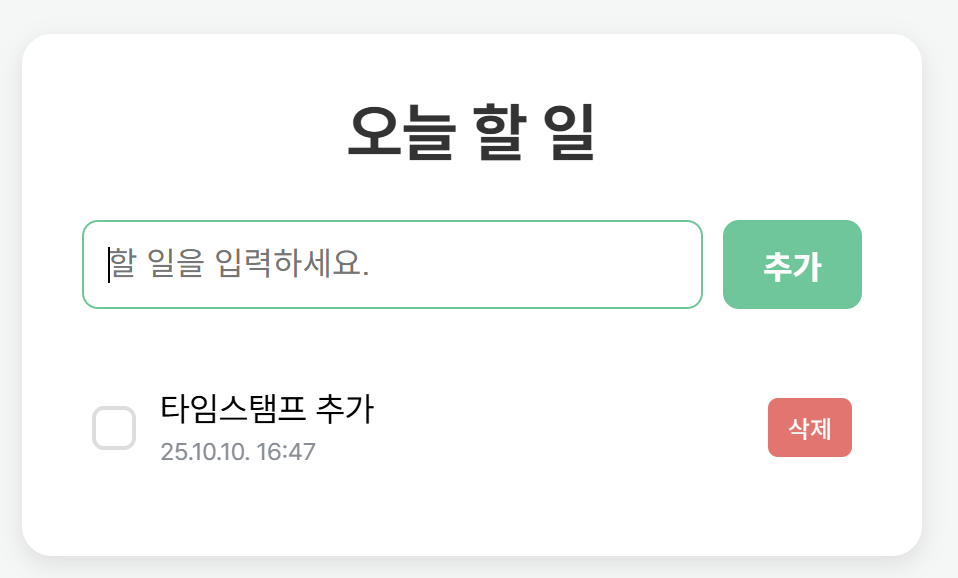

# 📝 3주차 프로젝트 과제

React의 핵심 기능인 `useState`와 `useEffect`를 학습하고, 컴포넌트 기반 개발을 연습하기 위해 만들어진 간단한 할 일 관리 애플리케이션입니다. 사용자가 할 일을 쉽게 추가, 완료, 삭제하고, 브라우저를 새로고침해도 데이터가 유지되는 기능을 제공합니다.

## ✨ 주요 기능 소개

### 1. `useState`를 활용한 상태 관리

- React의 `useState` Hook을 사용하여 할 일 목록(`todos`)과 사용자 입력(`input`)을 **상태**로 관리합니다.
- 상태가 변경될 때마다 UI가 자동으로 다시 렌더링되어 사용자는 항상 최신 목록을 볼 수 있습니다.

```jsx
// 파일: src/App.jsx

// 1. useState로 todos와 input 상태 선언
const [todos, setTodos] = useState(() => {
  /* ... localStorage 로직 ... */
});
const [input, setInput] = useState('');

// 2. 이벤트 핸들러에서 상태 변경 함수(setTodos)를 호출하여 상태를 업데이트
const handleAddTodo = (e) => {
  // ...
  setTodos((prevTodos) => [
    ...prevTodos,
    { id: Date.now(), text: input, completed: false /* ... */ },
  ]);
  setInput('');
};

const handleDeleteTodo = (id) => {
  setTodos((prevTodos) => prevTodos.filter((todo) => todo.id !== id));
};

const handleToggleTodo = (id) => {
  setTodos((prevTodos) =>
    prevTodos.map((todo) =>
      todo.id === id ? { ...todo, completed: !todo.completed } : todo
    )
  );
};
```

### 2. `localStorage`를 이용한 데이터 영속성

- 브라우저의 `localStorage`를 활용하여 할 일 목록을 저장합니다.
- 이를 통해 사용자가 브라우저를 닫거나 페이지를 새로고침해도 이전에 작성했던 할 일 목록이 그대로 보존됩니다.

```jsx
// 파일: src/App.jsx

// 1. 앱 시작 시 localStorage에서 데이터 불러오기 (getItem)
const [todos, setTodos] = useState(() => {
  const savedTodos = localStorage.getItem('todos');
  return savedTodos ? JSON.parse(savedTodos) : [];
});

// 2. todos 상태가 변경될 때마다 localStorage에 저장하기 (setItem)
useEffect(() => {
  localStorage.setItem('todos', JSON.stringify(todos));
}, [todos]);
```

### 3. `useEffect`를 활용한 효율적인 데이터 저장

- `useEffect` Hook을 사용하여 `todos` 배열이 변경될 때만 `localStorage`에 데이터를 저장하는 로직을 실행합니다.
- `[todos]` 의존성 배열을 통해 불필요한 재실행을 방지하여 애플리케이션의 성능을 최적화했습니다.

```jsx
// 파일: src/App.jsx

// todos 상태가 바뀔 때마다 안의 콜백 함수가 실행되어 localStorage에 데이터를 저장합니다.
useEffect(() => {
  localStorage.setItem('todos', JSON.stringify(todos));
}, [todos]);
```

### 4. 등록 시간 타임스탬프 기능

- 새로운 할 일을 추가할 때, `new Date()` 객체를 활용하여 `YY.MM.DD. 시:분` 형식의 타임스탬프가 함께 기록됩니다.
- 각 할 일 항목 아래에 등록 시간이 표시되어 언제 추가된 작업인지 쉽게 확인할 수 있습니다.

```jsx
// 파일: src/App.jsx
const handleAddTodo = (e) => {
  // ...
  // todo 등록한 시간 생성
  const now = new Date();
  const year = now.getFullYear().toString().slice(-2);
  const month = String(now.getMonth() + 1).padStart(2, '0');
  const day = String(now.getDate()).padStart(2, '0');
  const hours = String(now.getHours()).padStart(2, '0');
  const minutes = String(now.getMinutes()).padStart(2, '0');
  const createdAt = `${year}.${month}.${day}. ${hours}:${minutes}`;

  setTodos((prevTodos) => [
    ...prevTodos,
    // 생성된 시간을 객체에 담아 저장
    { id: Date.now(), text: input, completed: false, createdAt: createdAt },
  ]);
  // ...
};
```

```jsx
// 파일: src/components/TodoItem.jsx
function TodoItem({ todo, onToggleTodo, onDeleteTodo }) {
  return (
    <li className={`todo-item ${todo.completed ? 'completed' : ''}`}>
      {/* ... */}
      <div className="todo-text-container">
        <span className="todo-text">{todo.text}</span>
        {/* 저장된 createdAt 값을 화면에 표시 */}
        <span className="todo-timestamp">{todo.createdAt}</span>
      </div>
      {/* ... */}
    </li>
  );
}
```



## 🛠️ 보완할 점

- **편집 기능 없음**: 현재 할 일의 내용을 수정하는 기능이 없습니다. 사용자가 오타를 내거나 내용을 변경하고 싶을 때, 기존 항목을 삭제하고 새로 추가해야 하는 불편함이 있습니다.

## 🚀 추가하고 싶은 기능

1.  **할 일 내용 수정 기능**: 각 할 일 항목에 '수정' 버튼을 추가하고, 버튼을 누르면 입력창으로 전환되어 기존 내용을 편집하고 저장할 수 있는 기능을 구현하고 싶습니다.
2.  **필터링 기능**: '전체', '완료', '미완료' 상태에 따라 할 일 목록을 필터링해서 볼 수 있는 버튼을 추가하여 사용성을 높이고 싶습니다.
